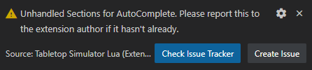
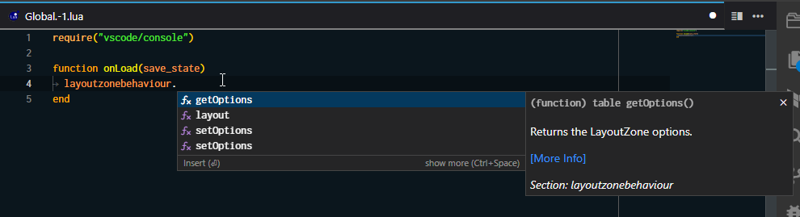
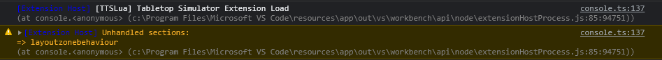

# TTS API Updates

As you may know, Tabletop Simulator receives updates from time to time, with these updates there's a good chance that the API offered for Lua has changed, which would mean that there would have to be a separate update for the extension incorporating these changes. For this reason this extension offers a simple and automated way to download the latest **available** API for TTS Lua, and store it locally on your machine to provide autocompletion items for VSCode's IntelliSense WITHOUT having to wait for a separate extension update.

This is done as a best-effort basis since there's no way to predict what might change in the future, the main purpose of this feature is to integrate the latest Lua API changes as soon as possible even if it's not perfect.

## How to use it?

Bring up the command palette <kbd class="kbc-button-sm">Ctrl</kbd>+<kbd class="kbc-button-sm">Shift</kbd>+<kbd class="kbc-button-sm">P</kbd> and begin typing `>Update IntelliSense with latest TTS API` then press <kbd class="kbc-button-sm">Enter</kbd> to execute the command.

## How does it work?

Atom's autocompletion is stored here: https://github.com/Berserk-Games/atom-tabletopsimulator-lua/blob/master/lib/provider.coffee

Whenever Berserk updates Atom's autocompletion, executing the command `ttslua.updateCompletionItems` will download this file, and process it to be integrated into VSCode. This process however does depend on Atom's autocomplete being updated soon-ish after any game update.

When updating the completion items the extension will check if the `provider.coffee` file has changed and only if so, it will download it and process it to be integrated into VSCode. If there are new "sections" a message will be shown like so:

This means that a new and unexpected section of autocompletion items has been created and each of these sections require it's own `trigger`. For example the `Zone` section has the `Zone` trigger but the `layoutzonebehaviour` section has the `LayoutZone` trigger. This means that while some section's triggers can be inferred, not all are standard and require a manual update for them to be consistent with TTS actual API.

However even if there are new sections, the extension will still make them available using the section name as trigger word. For example, if the `layoutzonebehaviour` section was just added and is marked as unhandled, it will be available using the `layoutzonebehaviour` trigger word. As such:

You can check the unhandled sections and it's trigger in the Developer Tools console:

And you can check the currently handled sections with their triggers [here](https://github.com/rolandostar/tabletopsimulator-lua-vscode/blob/main/src/vscode/LuaCompletionProvider.ts#L31)