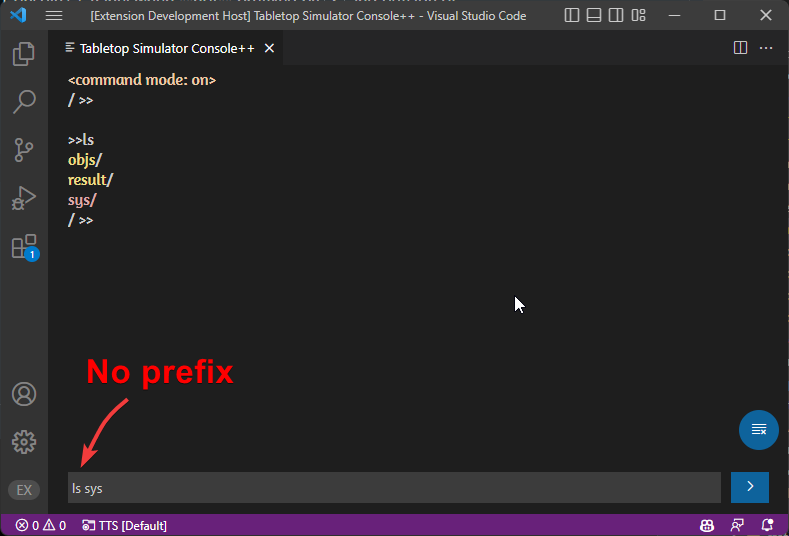

# Console++

This extension proves a quick and easy way to install Console++

By default, the TTS Console++ Panel will only show messages and errors from TTS, to enable further interaction you need to install [Console++](https://github.com/onelivesleft/Console) along with a modified version that enables `onExternalCommand` [More details here](/extension/onExternalCommand).

Bring up the Command Palette (<kbd class="kbc-button-sm">Ctrl</kbd>+<kbd class="kbc-button-sm">Shift</kbd>+<kbd class="kbc-button-sm">P</kbd>) and look up: ​`>TTSLua: Install Console++`

If successful you should see a notification near the bottom right letting you know so.

Finally activate the scripts by including them in your Global scope:

```lua
require("vscode/console")
```

Save and Play (<kbd class="kbc-button-sm">Ctrl</kbd>+<kbd class="kbc-button-sm">Alt</kbd>+<kbd class="kbc-button-sm">S</kbd>) And you can now use the input textbox at the bottom of the Console++ Panel that will send commands to the game directly from VSCode. Prefixing these messages with `>` will send your input as a command for Console++.

[Here is a tutorial series on how to use Console++](http://blog.onelivesleft.com/2017/09/debugging-your-tts-mods-with-console.html)

:::tip
Press enter or double click on the Console++ Panel to focus the command input at the bottom
:::

## Command Mode

If you only send `>` as input to the Console++ Panel, it will enter command mode. This allows you to send console++ commands without having to prefix each one with `>`. Like so:


