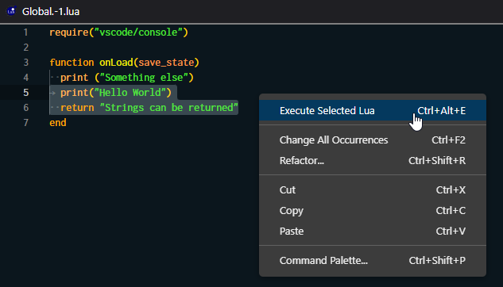
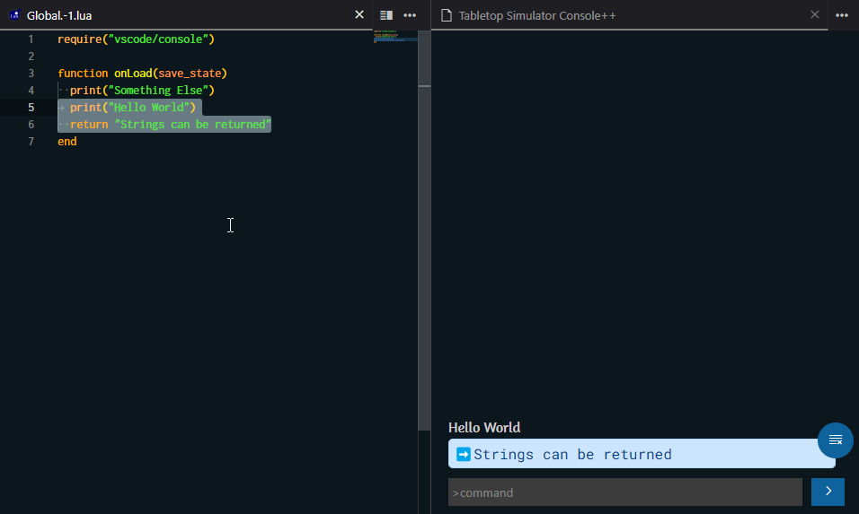

# Execute Lua

This feature allows developers to select a piece of Lua code and execute it in the game. This is useful for testing small snippets of code without having to save the file and then reload the game. The ability to visualize return values is also very useful.

## How to use

Select any piece of Lua code and right click or <kbd class="kbc-button-sm">Ctrl</kbd>+<kbd class="kbc-button-sm">Alt</kbd>+<kbd class="kbc-button-sm">E</kbd> or bring up the command palette and type `>Execute Lua` and press <kbd class="kbc-button-sm">Enter</kbd> to execute the command.

This will result in the following:

The message is logged (both in-game and console++) and the return value is displayed in console++ in a special blue callout.

The executed script will be called from the object which is currently selected in the editor. eg. If you execute lua from the `Global.-1.lua` file it will be sent with the `-1` GUID same thing if you were to execute lua from another object. It will run as if it was called from that object itself.

When the Console++ panel is not opened, the return value will be outputted in a Information Message like so:

