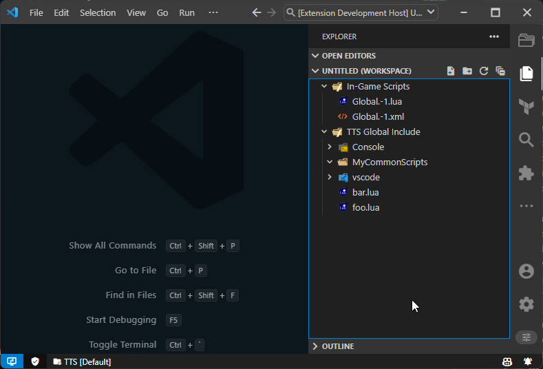
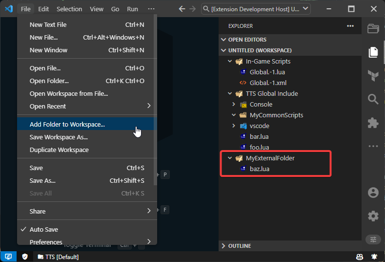

This extension, similar to the official Atom Plugin, allows developers to structure their scripts among several files, the way of doing so is with the following statements:

- `require("<FILE>")` for Lua
- `<Include src="<FILE>"/>` for XML

The way this is accomplished is with a combination of the [includePaths](/) Configuration and the [luaSearchPattern](/) Configuration.

## Include Paths

Include paths are all the additional paths that the extension will search for files when resolving `require` or `<Include>` statements. The default value for this is `[]` which means that the extension does not search in any **additional** include paths.

I'm highlighting the word **additional** because the extension will always search in the Documents Folder `~Documents/Tabletop Simulator` *and* every folder currently opened in the workspace. These are resolved according to this [ordered priority list](https://github.com/rolandostar/tabletopsimulator-lua-vscode/blob/main/src/TTSAdapter.ts#L44), stopping at the first match.

Priority from highest to lowest:
1. Documents Folder: `~/Documents/Tabletop Simulator`
2. Folders described in `ttslua.fileManagement.includePaths` config
3. Folders currently opened in the workspace

Specifically for XML, modules can also be resolved relative to each other. This is done by looking for files ending with `.xml` by default.

## Lua Search Pattern

Specifically for Lua, the `ttslua.fileManagement.luaSearchPattern` setting allows modification of the Lua lookup pattern. The extension will look for files ending with `.lua` by default. More info on search patterns here: https://www.lua.org/pil/8.1.html

## Examples

Assume the following file structure for all the examples:

```
Documents/Tabletop Simulator
├── Console
|  ├── console.lua
|  └── console++.lua
├── MyCommonScripts
|  └── oftenUsed.lua
├── vscode
|  └── console.lua
├── bar.lua
└── foo.lua
```

Remember that the console and console++ files are installed in the Documents Folder by default, so they are always available. Check out the [Console++ Guide](/guides/console++) for more info on how to install these files.

If you were to execute the `TTSLua: Add Global include folder to workspace` command, and get the scripts from the game, it would look something like this:



If you go to the `File` Menu and select `Add Folder to Workspace`, you can add external folders eg. `MyExternalFolder`. This will allow you to also require scripts from there:



#### Which modules can be resolved so far?

- `require("Console/console")` will resolve to `~/Documents/Tabletop Simulator/Console/console.lua`
- `require("MyCommonScripts/oftenUsed")` will resolve to `~/Documents/Tabletop Simulator/MyCommonScripts/oftenUsed.lua`
- `require('baz')` will resolve to `..../MyExternalFolder/baz.lua`
- `require('bar')` will resolve to `~/Documents/Tabletop Simulator/bar.lua`

Let's add more files to the external folder, like so:

```
.../MyExternalFolder
├── bar.lua
└── baz.lua
```

This would mean that:
- `require('bar')` will **still** resolves to `~/Documents/Tabletop Simulator/bar.lua`

Even when the file is in a workspace folder, the extension will always prioritize the Documents Folder. This is because the Documents Folder is always available, and the workspace is not. As indicated by the ordered priority list above.

Let's change it up, what would happen if the following was added to the `ttslua.fileManagement.includePaths` setting:

```json
{
  ...
  "ttslua.fileManagement.includePaths": [
    "~/AnotherPath/myScripts"
  ]
}
```

And it's corresponding file structure:

```
~/AnotherPath/myScripts
├── bar.lua
└── baz.lua
```

This would mean that:
- `require('bar')` **still** resolves to `~/Documents/Tabletop Simulator/bar.lua` (Docs folder has higher priority than include paths)
- `require('baz')` resolves to `~/AnotherPath/myScripts/baz.lua` (include paths have higher priority than workspace folders)

## If you still have questions...

Check out the [Debugging Module Resolution](/support/debuggingModuleResolution) page for further information on how to debug module resolution.