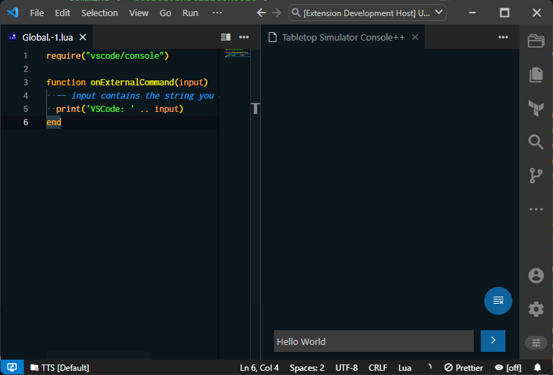
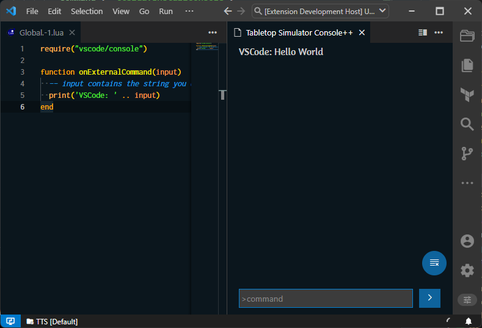

# External Command

When you `require("vscode/console")` a new function is added to the global scope called `onExternalCommand`. This function is called when the extension receives a command from the VSCode Console++ Panel when **not** prefixed by `>` and outside of command mode. [More details on command mode here](/guides/console++#command-mode).

Whenever you press enter on the Console++ Panel the extension will send the command to the game. If the command is prefixed by `>` it will be sent to the game as a command, otherwise it will be sent as `External Command`. The game will then call the `onExternalCommand` function with your input as the first argument.

For example the following script stored in `Global.-1.lua`

```lua
require("vscode/console")

function onExternalCommand(input)
  -- input contains the string you entered from VS Code
  print('VSCode: ' .. input)
end
```

When you enter `Hello World` in the Console++ Panel, the game will call the `onExternalCommand` function with the string `Hello World` as the first argument. The game will then print `VSCode: Hello World` to the console.

Write `Hello World` in Console++ Panel



Press Enter



You can use this function to trigger any kind of custom behavior inside TTS, like a custom command system, or for debugging.