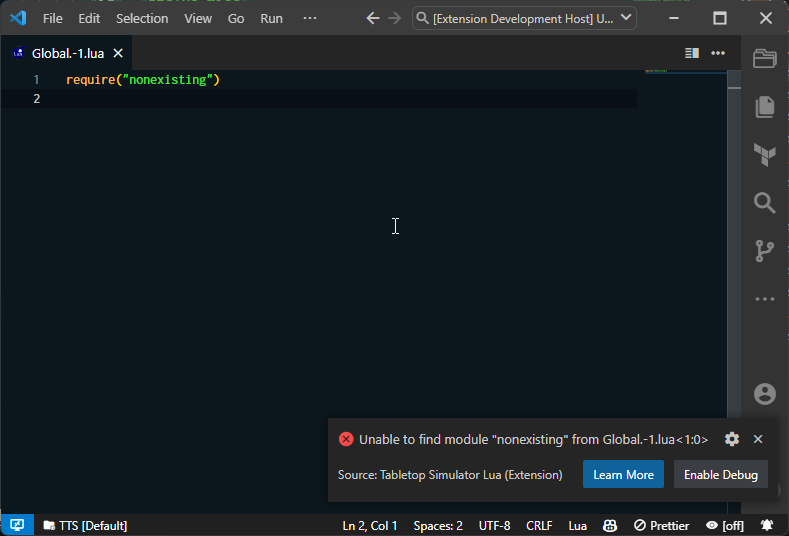
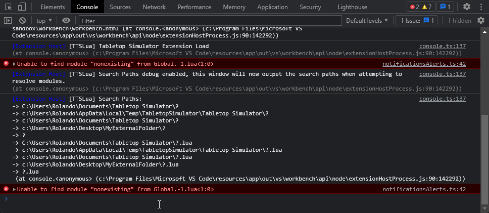

# Debugging Module Resolution

When you are having trouble with module resolution, you can use the `ttslua.misc.debugSearchPaths` config to output the search paths used by the extension at resolve time.

```json
{
  "ttslua.misc.debugSearchPaths": "true"
}
```

This will output the search paths to the developer console. Which can be toggled with <kbd class="kbc-button-sm">Ctrl</kbd>+<kbd class="kbc-button-sm">Shift</kbd>+<kbd class="kbc-button-sm">I</kbd>

Here's an example when trying to require a non-existent module:



And when clicking on `Enable Debug` button, the config will be turned on and the search paths will be outputted to the developer console:



Where `?` will be replaced by the module name.
